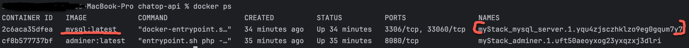
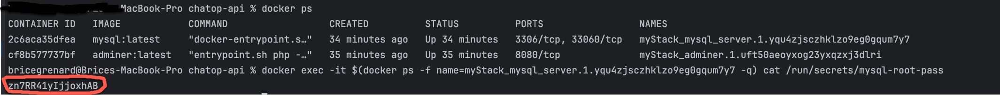

# Chatop.API

API endpoints for project number 3 Openclassrooms

For the database part, I am using docker as a local container, the configuration file "docker-compose.yml" can be found at the root of the chatop-api project.

* One MySQL instance
* One Adminer instance
* A database named 'db_chatop'

I am using docker secrets to manage any sensitive data such as database password which the container needs at runtime but you don't want to store in the image or in source control.
https://docs.docker.com/engine/swarm/secrets/

In order to use docker secrets, you need to follow steps:

* Run docker in swarm mode by using
+
[source]
$ docker swarm init
--

* Create a random password for the root user by using openssl (mysql-root-pass is the secret name defined in docker-compose.yml)
+
[source]
$ openssl rand -base64 12 | docker secret create mysql-root-pass -
--

Deployment time!

* Deploy the stack
+
[source]
--
$ docker stack deploy -c docker-compose.yml myStack
--

Because the root password has been randomly generated, we need following command to view its actual value.

* We need to get a list of processes running so that we can extract the name of the actual running instance of mySQL
+
[source]
--
$ docker ls
--

You should get something like this:

* Finally we can extract the password via the following command (replace with the name of the running instance of mySQL as shown as here-above picture)
+
[source]
--
$ docker exec -it $(docker ps -f name= instanceName -q) cat /run/secrets/mysql-root-pass
--

The actual password value will be displayed as here-below

You can now connect to the MySQL instance by connecting to the web interface of adminer running on http://127.0.0.1:8080  as root user (that is bad practice in production!).